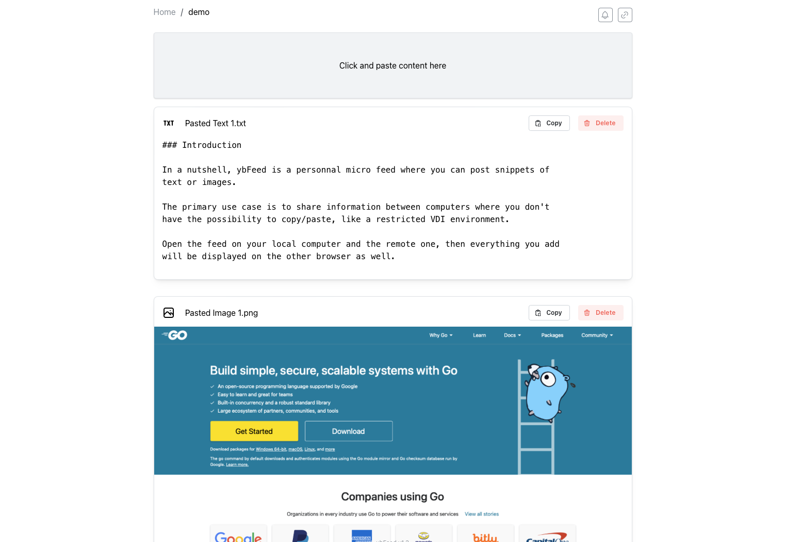

### Introduction

**ybFeed** is a personal micro feed where you can post snippets of 
text or images.

The primary use case is to share information between computers when you don't
have the possibility to copy/paste, like on a restricted VDI environment.

Open the feed on your local computer, and the remote one, then everything will
be kept in sync when you add or remove items.

### Concepts

On ybFeed home page, you are invited to create a feed with a unique name.

Once on a feed, you can paste data in it, text or images, they will be
displayed in reverse order.

You can then decide to share the feed two different ways :

- Copy a secret link to the feed, that you can paste on a different computer,
you will be automatically authenticated
- Set a temporary 4 digit PIN. You then go to another computer and open the
feed. You will be prompted for the PIN to unlock it.

### Screenshot



### Caveats

This is just a side project I'm working on, so there is probably lots of issues.

Feel free to open GitHub issues to reuest features or bug fixes.

Here are some I already identified :

- Paste might not work over non secured connections (https), this is a
limitation as a security measure with some web browsers
- ybFeed relies on a cookie to authenticate a session, if the cookie is lost
there is no easy way to retrieve the feed (you can get it back from the
`config.json` file in the feed directory)
- Most modern browser won't honor long cookie lifetime, you might have to
recover the secret from `config.json` if it happens.
- Security could probably be improved, tokens and PINs are stored in clear on
the filesystem
- No rate control or capacity limits, quite exposed to flooding as it is

### Environment variables
| Variable name | Description |
|---------------|-------------|
| `YBF_DATA_DIR` | points to an alternative direcotry to store data, default is `./data/` in current directory. |
| `YBF_HTTP_PORT` | TCP port to run the server, default is `8080`. |

### Installation

#### Using Docker registry

Use this method to treat youself with a quick demo of the most current version

```
mkdir data
docker run -p 8080:8080 -v $(pwd)/data:/data ghcr.io/ybizeul/ybfeed:latest
```

You can now point your browser to http://localhost:8080/

#### Using Docker from source

Use this method if you're interested by the code and hacking around

```
git clone https://github.com/ybizeul/ybFeed.git
cd ybFeed
docker compose up -d
```

You can now point your browser to http://localhost:8080/

### Building

#### Using Makefile

```
make
```

#### Manually

Once you cloned the repository, issue the following commands :
```
cd web/ui/

# Install node dependencies
npm install

# Build UI
npm run build

# Build Go binary
cd ../../
go build -o ybFeed cmd/ybfeed/*.go

# Run ybFeed
./ybFeed

# Point your browser to port http://localhost:8080
```

#### Building container

```
docker build . -t ybfeed
```
